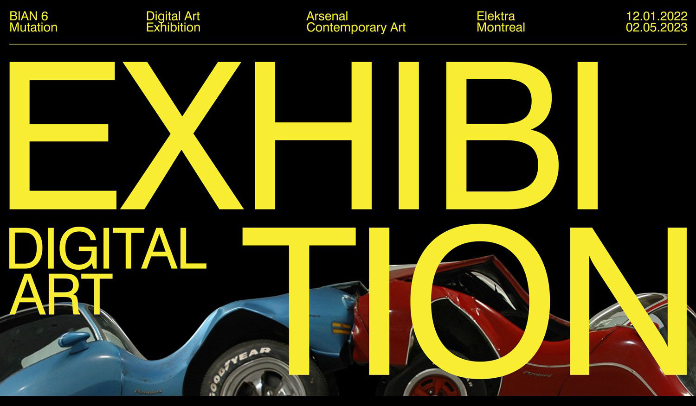

# Travail 1A
## Exposition BIAN6

## Arsenal 2020
## Exposition temporaire et intérieure
## Le 2 Février, 2023
## Résonances
## Louis-Philippe Rondeau
## 2021
## Description de l'oeuvre
Cette boucle visuelle et sonore permet à l'interacteur de chorégraphier son présent en le construisant sur son propre passé, de manière ludique et singulière.
## Installation interactive
## Mise en espace
L'affichage DEL est situé dans le milieu du pièce, sur une platforme de bois. situé devant et perpandiculaire de l'affichage est un écran avec des haut-parleurs à ses côtés et un ordinateur situé derrière l'ordi. 

## Composantes et techniques
Installation interactive, bois, acier, acrylique, affichage DEL, ordinateur, haut-parleur, composants électroniques.
## Éléments nécessaires à la mise en exposition
Platforme de bois, haut-parleurs, écran, étiquette du musée.
## Expérience vécue
Pour interagir avec Résonances, il faut simplement passer à travers l'affichage DEL, et l'image du personne apparaîtra sur l'écran. À mon avis, l'installation était amusant à interagir avec, mais ça na pas laissé des grandes impréssions sur moi.
## Ce qui m'a plu
J'ai aimé pouvoir interagir avec l'installation, parce que c'était un des seuls oeuvre qui était interactive.
## Ce que je ferait autrement
J'aurait ajusté comment les images apparaient sur l'écran, parce que, la majorité du temps, les images des interacteurs avaient l'air vraiment bizarre.
## Références
Étiquette du muséé

