 # Mycelium
 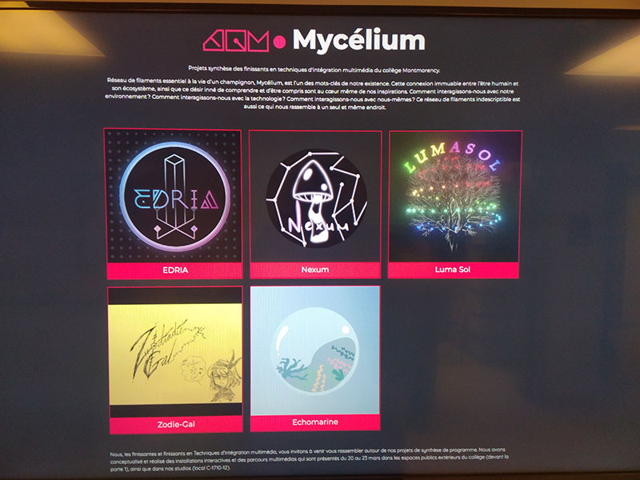
 
## 1. Echomarine

### Créatrices: Florence Lapierre, Natacha Abdallah, Tracy Gua, Maria Laura Coronel
Je crois qu'il y a un bon lien entre Echomarine et le thème de Mycelium car le but d'Echomarine est de prevenir les gens aux dangers les animaux marines et cel de Mycelium est de explorer comment les êtres humains interagisent avec le monde autour d'eux.

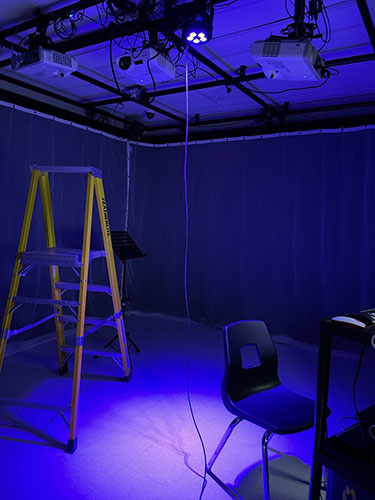

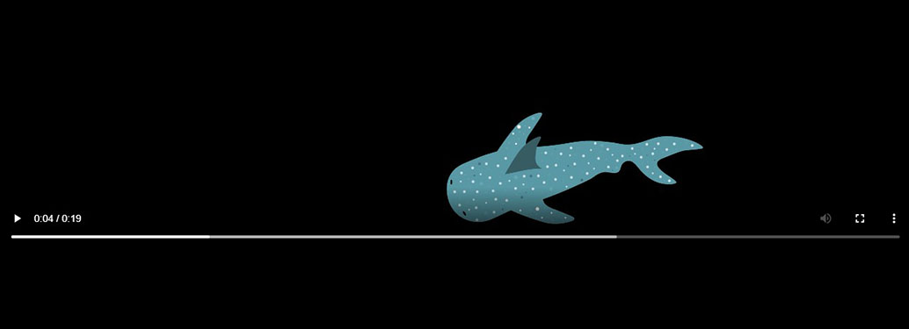

## 2. Zodie-Gal
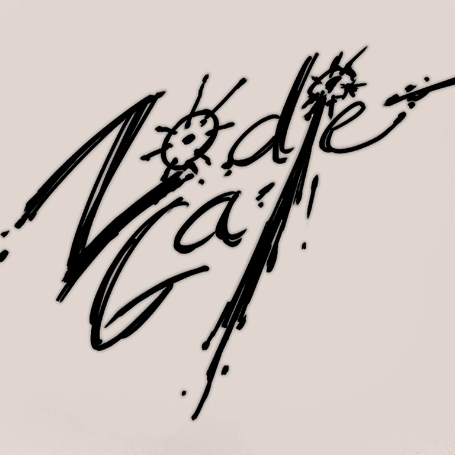

### Créatrice: Abdanor Yara
L'histoire dans Zodie-Gal est d'une jeune fille qui est dans sa première periode de puberté est comment elle confronte ses peurs d'adolescantes. Je crois que ça a un bon lien avec le thème de interagir avec nous-même de Mycelium. 

## 3. Luma Sol
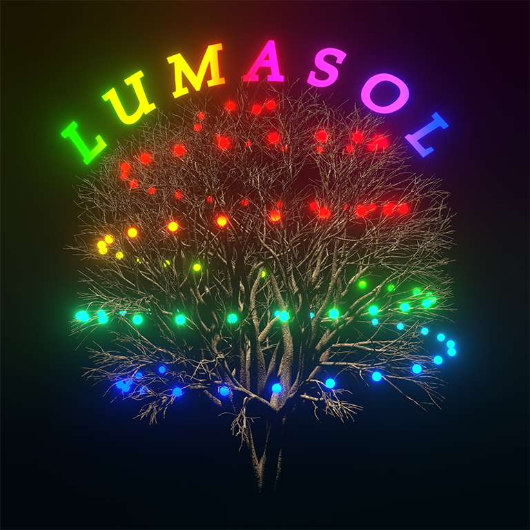

### Créateurs: Éloïse Gagné, Skayla Stimphil, Michaël Simard, Pénélope Morrisson
Le but de Luma Sol est de sensibiliser les gens aux conséquences du changement climatiques, plus précisement sur l'environnemnt lumineux. Les participants seront donc encouragés à pédaler pour leur montrer que leurs actions peuvent avoir un impact positif. C'est parfait pour le thème environnemental de Mycelium.

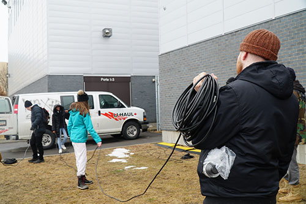

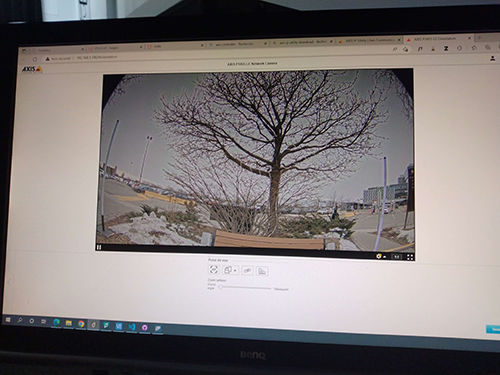

## 4. EDRIA
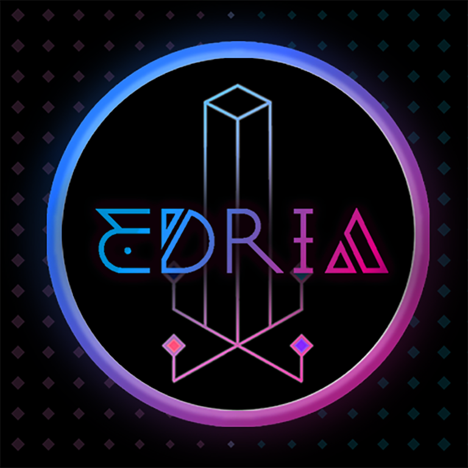

### Créateurs: Elwin Durand, Loic Delorme, Dominic Roberts, Gabriel Leblanc, Meryem Berbiche, Jean-Christophe
L'installation central d'EDRIA est supposé de représenter du terre inconnue dans le milieu d'hiver, avec un nouveaux écosystème qui a besoin de plusieurs personne pour dévoiler plus de ses secrets. Cela pourrait être un métaphore pour représenter l'idée qu'on a besoin de coopérer ensemble pour découvrir la beauté du Terre. C'est bien lié avec le thème environnemental de Mycelium.

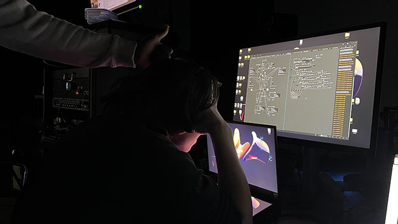
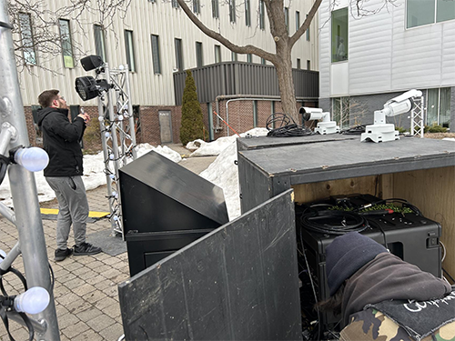
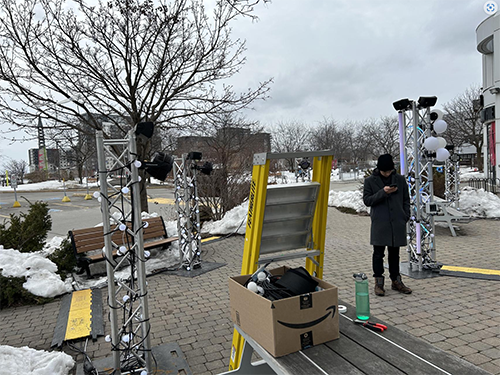

## 5. Nexum
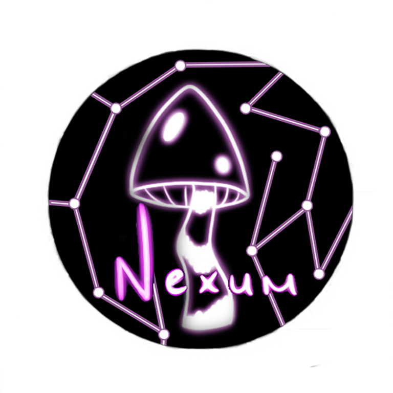

### Créateurs:  Sébastien Reilly, Sabrina Laforest, Alexandre Daniel, Maxime Des Lauriers
L'installation de Nexum et le thème de Mycelium ont le même but; de reétablir le lien entre les êtres humains et notre environnement. Nexum utilise une expérience lumineuse immersive, des animations sensationnelles et une ambiance musicale pour t'enchanter avec une expérience immersif.

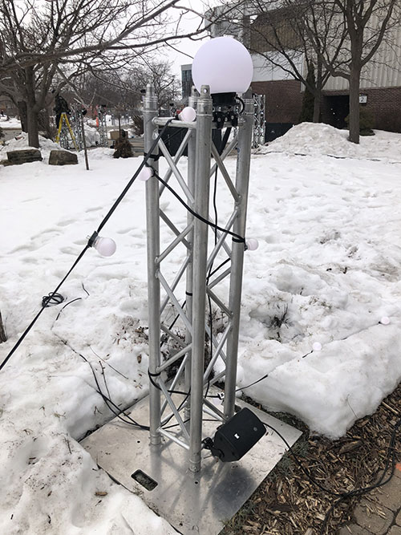
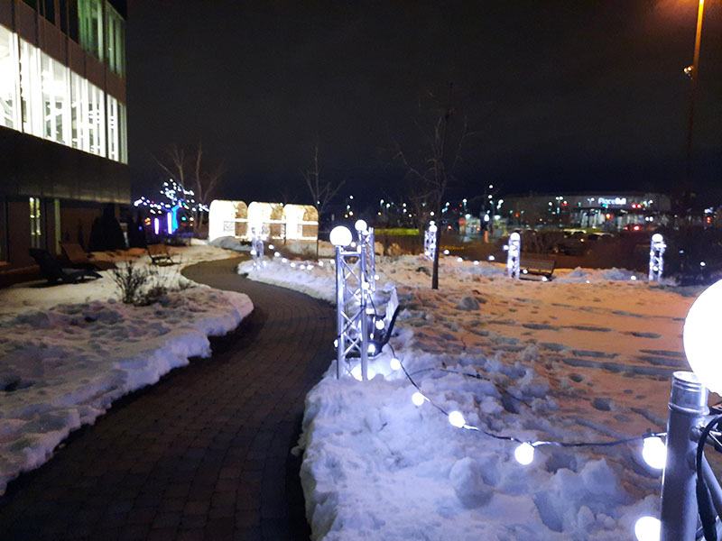
