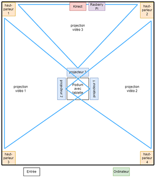
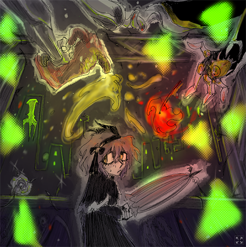
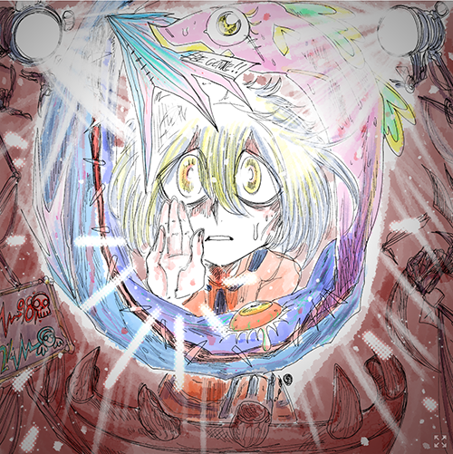
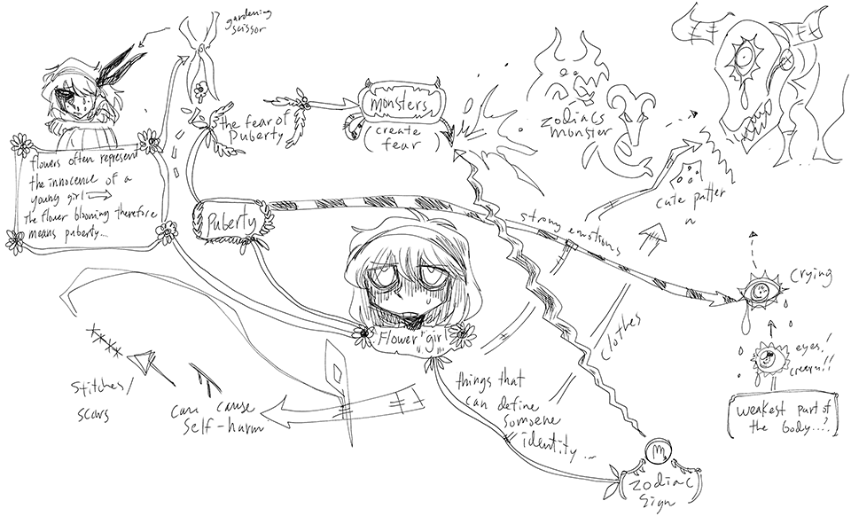
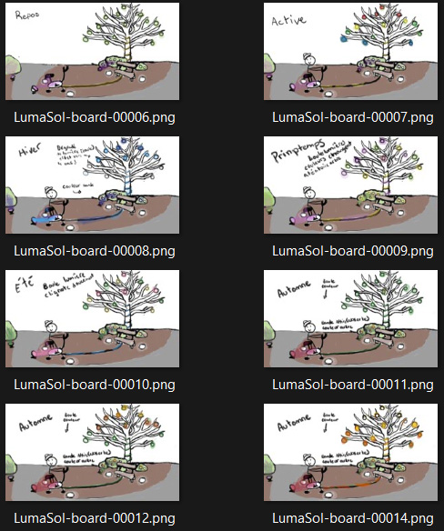
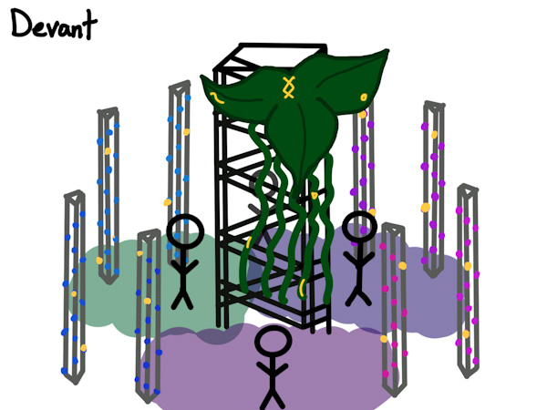
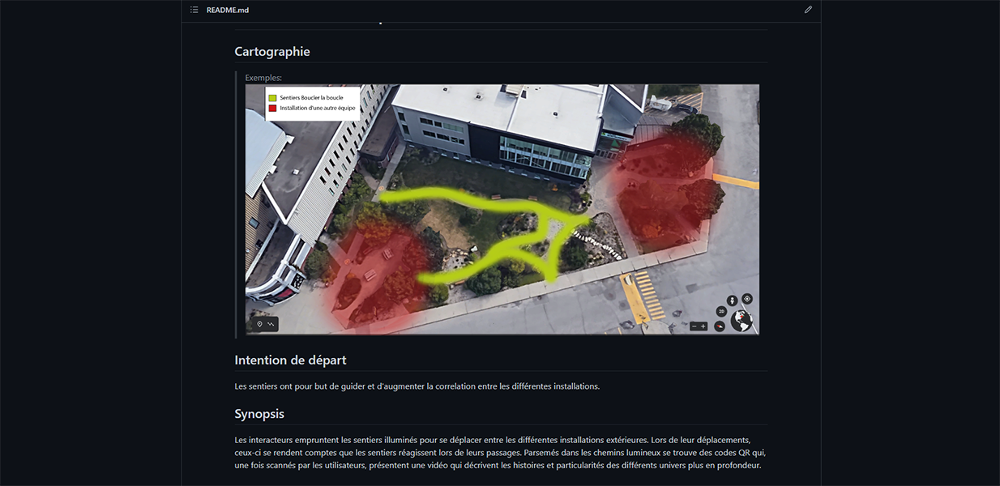

 # Mycelium
 
 
## 1. Echomarine

### Créatrices: Florence Lapierre, Natacha Abdallah, Tracy Gua, Maria Laura Coronel
Je crois qu'il y a un bon lien entre Echomarine et le thème de Mycelium car le but d'Echomarine est de prevenir les gens aux dangers les animaux marines et cel de Mycelium est de explorer comment les êtres humains interagisent avec le monde autour d'eux. Pour créer Echomarine, Elles ont dû installées des lumiéres, projecteurs et haut parleurs et programer un systeme de sons et des animations. Je crois que je ressentira la désespoir et l'espoir tout en éprouvant Echomarine, car il a pour but de nous sensibiliser au destruction de l'environnement marine et que nous avons encore du temps pour le sauver.

### Schéma: 

### Cours importants: Audio 2, Animation 2D, Design graphique

## 2. Zodie-Gal

### Créatrice: Abdanor Yara
L'histoire dans Zodie-Gal est d'une jeune fille qui est dans sa première periode de puberté est comment elle confronte ses peurs d'adolescantes. Je crois que ça a un bon lien avec le thème de interagir avec nous-même de Mycelium. Pour créer Zodie-Gal, elle a dû programmer un jeux vidéo avec 2 images pour chaque niveaux; un qui illustre le niveau et l'autre qui illustre la victoire du joueur. Je crois que je ressentira l'impuissance et la peur d'une jeune fille qui doit expériencer la puberté la première foit en experiancant tout en éprouvant Zodie-Gal.

### Schéma: 

### Cours importants: Animation 2D, Audio 2, Interactivité ludique  

## 3. Luma Sol

### Créateurs: Éloïse Gagné, Skayla Stimphil, Michaël Simard, Pénélope Morrisson
Le but de Luma Sol est de sensibiliser les gens aux conséquences du changement climatiques, plus précisement sur l'environnemnt lumineux. Les participants seront donc encouragés à pédaler pour leur montrer que leurs actions peuvent avoir un impact positif. C'est parfait pour le thème environnemental de Mycelium. Pour créer Luma Sol, ils ont dû créer une ambiance sonore et des effets sonores, les programmer pour correspondre à la présence d'un vélo et installer des lumiéres, le vélo et un caméra à l'extérieur. Je crois que je ressentira de l'espoir tout en éprouvant Luma Sol, car son thème démontre que nous ne sommes pas impuissant et que nos actions peuvent changer le monde.

### Schéma: 

### Cours importants: Interactivité ludique, Audio 2, Objets interactifs

## 4. EDRIA

### Créateurs: Elwin Durand, Loic Delorme, Dominic Roberts, Gabriel Leblanc, Meryem Berbiche, Jean-Christophe
L'installation central d'EDRIA est supposé de représenter du terre inconnue dans le milieu d'hiver, avec un nouveaux écosystème qui a besoin de plusieurs personne pour dévoiler plus de ses secrets. Cela pourrait être un métaphore pour représenter l'idée qu'on a besoin de coopérer ensemble pour découvrir la beauté du Terre. C'est bien lié avec le thème environnemental de Mycelium. Pour créer EDRIA, ils ont dù mettre en place des senseurs sur leur installation central pour capter les mouvements des gens. Il fallait aussi qu'ils corriger la programmation des sons et des lumiéres pour qu'ils puissent activer au même temps pour ne pas gâcher l'ambiance. Je crois que je ressentira de l'espoir tout en éprouvant EDRIA, car son thème démontre que même dans un hiver très froid, il-y-a du terre qui reste intacte et sûre de survivre.

### Schéma: 

### Cours importants: Objets interactifs, Traitement audiovisuel, Audio 2

## 5. Nexum

### Créateurs:  Sébastien Reilly, Sabrina Laforest, Alexandre Daniel, Maxime Des Lauriers
L'installation de Nexum et le thème de Mycelium ont le même but; de reétablir le lien entre les êtres humains et notre environnement. Nexum utilise une expérience lumineuse immersive, des animations sensationnelles et une ambiance musicale pour t'enchanter avec une expérience immersif. Pour créer Nexum, ils ont dû se familiariser avec l'environnement pour préparer le trajet de leur installation, programmer les senseurs pour qu'ils activent les haut parleurs et les lumiéres et créer des animations pour leur code QR. Je crois que je ressentira l'esprit d'équipe tout en éprouvant Nexum, car si nous ne pouvont pas coexister avec notre environnement, nous finirons par le détruire, et, par conséquent, nous aussi. 

### Schéma: 

### Cours importants: Objets interactifs, Installation multimédia, Traitement audiovisuel

## Références

[Mycelium](https://tim-montmorency.com/2023/), [Grille de cours multimédia](https://www.cmontmorency.qc.ca/programmes/nos-programmes-detudes/techniques/techniques-dintegration-multimedia/grille-de-cours/)
